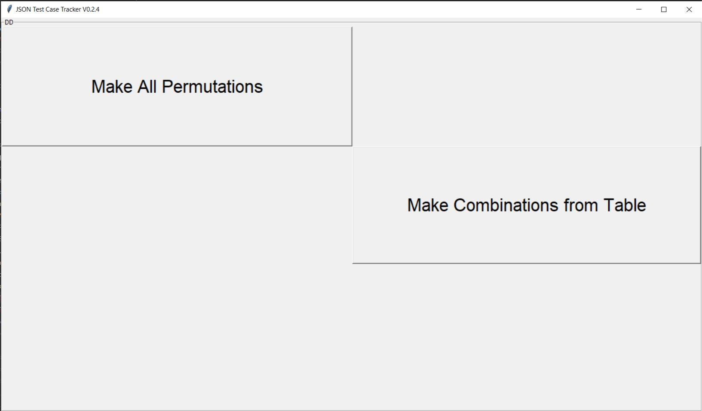
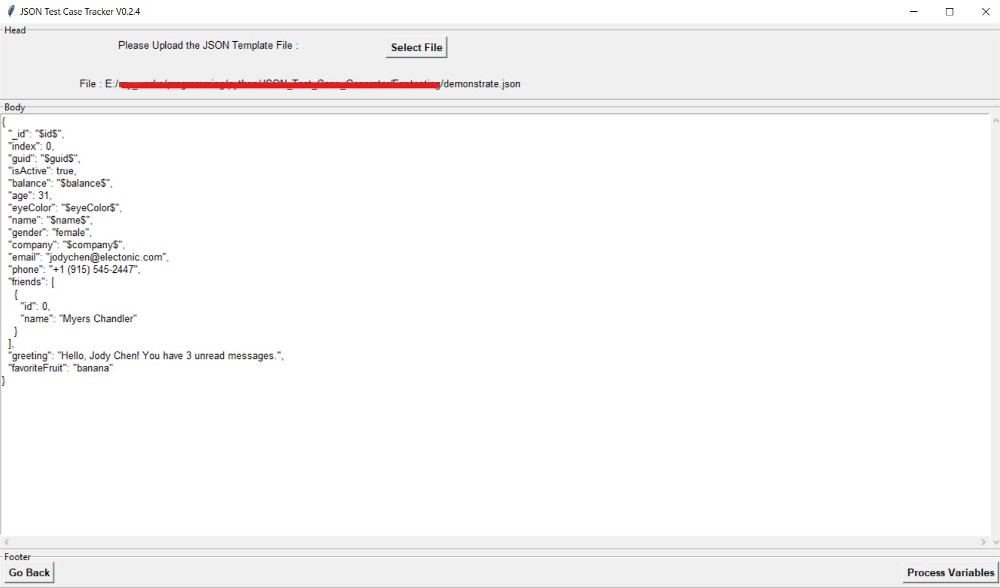
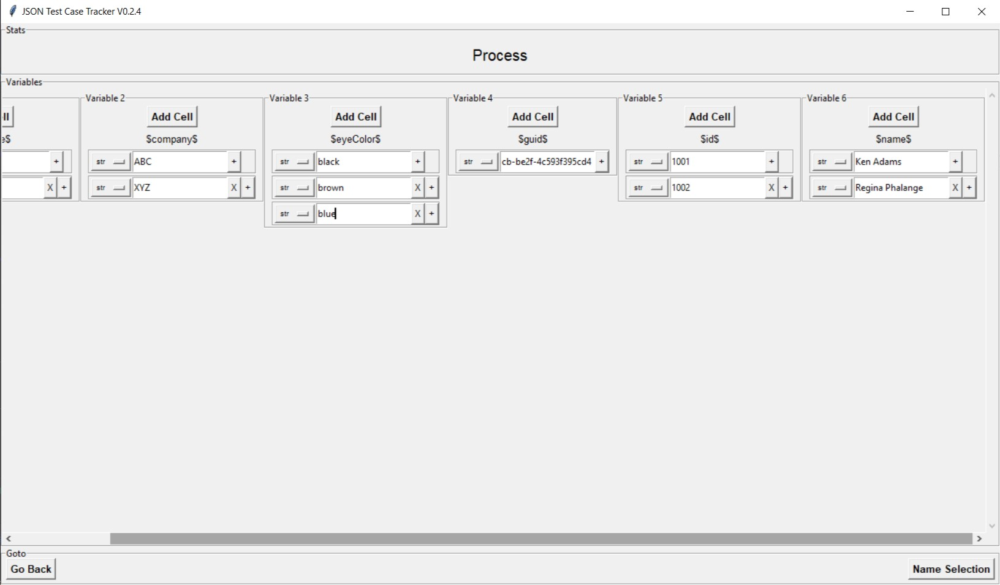
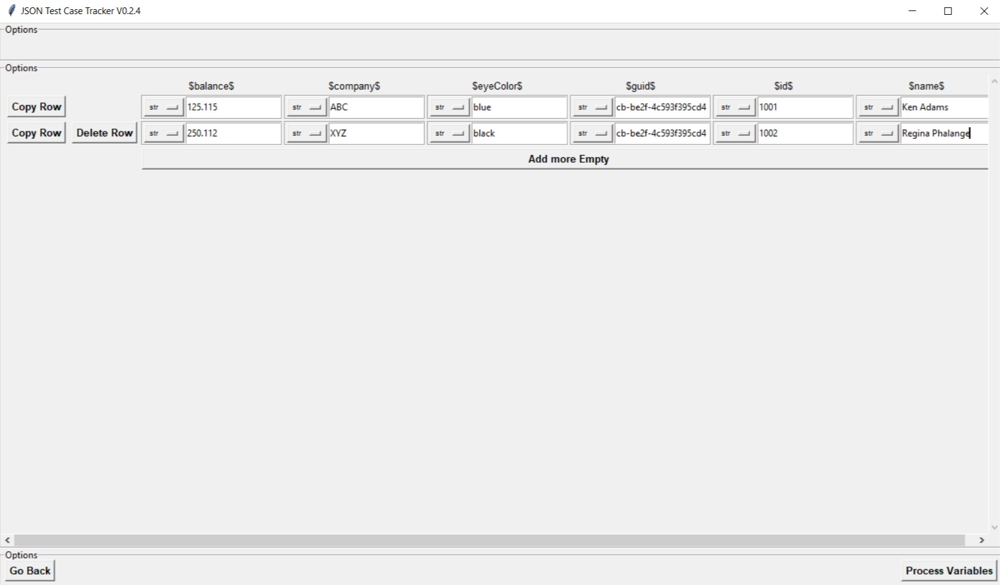
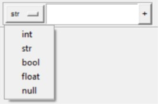
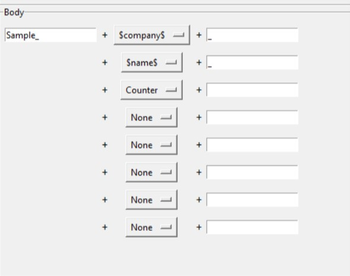
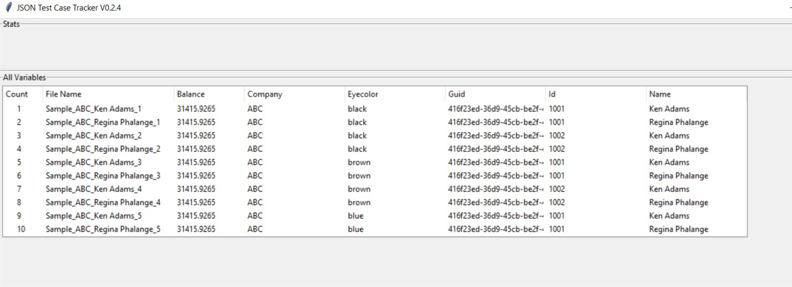
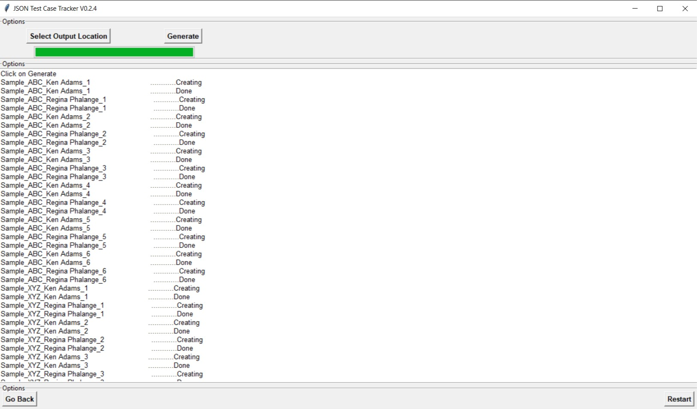
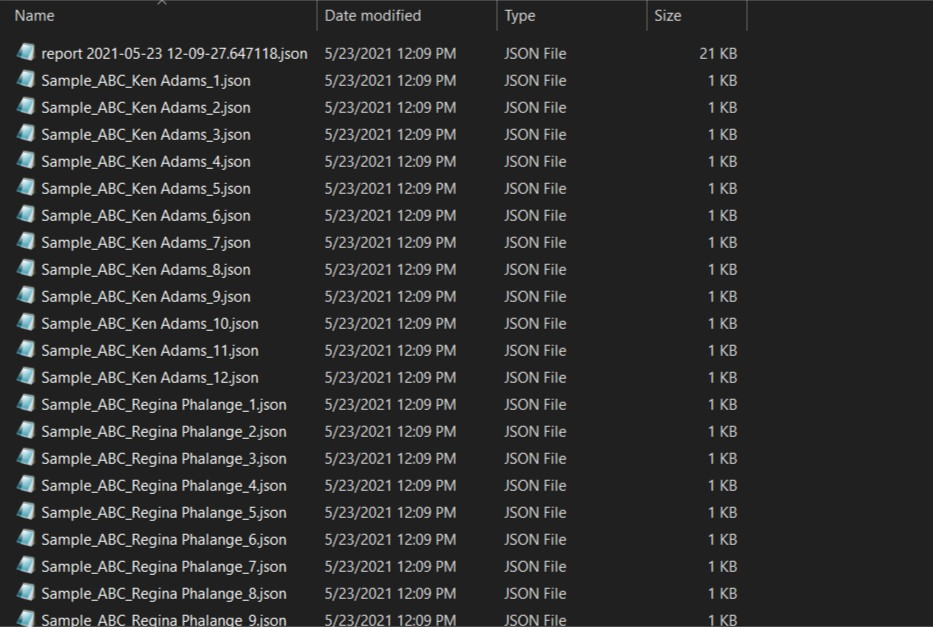

# JSON Test Case Generator

You can use the [JSON Test Case Generator](https://github.com/linjorejoy/json-testcase-generator) to generate many JSON files in a controlled manner

- [JSON Test Case Generator](#json-test-case-generator)
- [How to Use](#how-to-use)
  - [Initializing the JSON File](#initializing-the-json-file)
  - [Start Page](#start-page)
  - [Uploading the JSON File](#uploading-the-json-file)
  - [Process Variables](#process-variables)
      - [example](#example)
    - [Generating All Permutations](#generating-all-permutations)
    - [Generating Using Table](#generating-using-table)
      - [Datatypes in Variables](#datatypes-in-variables)
  - [Naming the Files](#naming-the-files)
  - [Preview](#preview)
  - [Generate](#generate)
  - [Output Folder](#output-folder)
  - [Report](#report)
- [About](#about)
- [Features List with Upcoming Features](#features-list-with-upcoming-features)
- [Download](#download)

---

# How to Use

## Initializing the JSON File

To initialize all the variablesto the Application, the JSON File needs to be prepped.

You can initialize the variables by remapping then in the pattern `$variableName$`. For Example,


In the above example there are 6 variables initialized which are marked in bright green.

> Note : For all Data Types(`string`, `int`, `float`, `bool` or `null`), enclose the mapped variables inside double quotes as shown in the above example.

You can also concatenate variables together or with other strings as shown in the below example.


---

## Start Page

You can select 2 paths from here.

- [Generate All Permutation](#generating-all-permutations)
- [Generate Using Table](#generating-using-table)



---

## Uploading the JSON File

Click on the **Select File** Button and select the JSON template file that you created in your [previous step](#initializing-the-json-file).

Upload Page snapshot :



---

## Process Variables

This is the step where you have to define the test cases that needs to be created. I will use the below example

I am going to use this json file which has **6** variables

#### example

```json
{
  "_id": "$id$",
  "index": 0,
  "guid": "$guid$",
  "isActive": true,
  "balance": "$balance$",
  "age": 31,
  "eyeColor": "$eyeColor$",
  "name": "$name$",
  "gender": "female",
  "company": "$company$",
  "email": "jodychen@electonic.com",
  "phone": "+1 (915) 545-2447",
  "friends": [
    {
      "id": 0,
      "name": "Myers Chandler"
    }
  ],
  "greeting": "Hello, Jody Chen! You have 3 unread messages.",
  "favoriteFruit": "banana"
}
```

### Generating All Permutations

It will generate all the Permutations of the variation of all the inputs provided.

For Example, assume there are `4` variables having `8, 8, 7, 8` variations respectively. Then it will create.

> 8 x 8 x 7 x 8 = 3584 different variations

**So the number of variations can increase very fast.**


> As Stan Lee (May he Rest in Peace) in his Spider Man Comics once Said [**With great power comes great responsibility**](https://en.wikipedia.org/wiki/With_great_power_comes_great_responsibility), you should use this method cautiously.

For My [example](#example).



### Generating Using Table

Here we can generate the variations in a controlled manner

For Example,


In the above example only 2 files will be created.

#### Datatypes in Variables

You can change the datatype of each cell from the dropdown as shown below



<center>
<table>
<tr>
<th>DataType</th>
<th>Input</th>
<th>Output in JSON</th>
</tr>
<tr>
<td rowspan=5>str</td>
<td>hello</td>
<td rowspan=5 >
<pre>
  "someKey": "hello"|"125"|"true"
</pre>
</td>
</tr>
<tr>
<td>125</td>
</tr>
<tr>
<td>125.68</td>
</tr>
<tr>
<td>true</td>
</tr>
<tr>
<td>null</td>
</tr>
<tr>
<td rowspan=5>int</td>
<td>hello</td>
<td>

<pre>
  "someKey": "hello"
</pre>

</td>
</tr>
<tr>
<td>125</td>
<td rowspan=2>

<pre>
  "someKey": 125 | 125.68
</pre>

</td>
</tr>
<tr>
<td>125.68</td>
</tr>
<tr>
<td>true</td>
<td rowspan=2>

<pre>
  "someKey": "true" | "null"
</pre>

</td>
</tr>
<tr>
<td>null</td>
</tr>
<tr>
<td rowspan=5>float</td>
<td>hello</td>
<td>

<pre>
  "someKey": "hello"
</pre>

</td>
</tr>
<tr>
<td>125</td>
<td rowspan=2>

<pre>
  "someKey": 125.0 | 125.68
</pre>

</td>
</tr>
<tr>
<td>125.68</td>
</tr>
<tr>
<td>true</td>
<td rowspan=2>

<pre>
  "someKey": "true" | "null"
</pre>

</td>
</tr>
<tr>
<td>null</td>
</tr>
<tr>
<td rowspan=5>bool</td>
<td>hello</td>
<td rowspan=4>

<pre>
  "someKey": "hello" | "125" | "null"
</pre>

</td>
</tr>
<tr>
<td>125</td>
</tr>
<tr>
<td>125.68</td>
</tr>
<tr>
<td>null</td>
</tr>
<tr>
<td>true</td>
<td>

<pre>
  "someKey": true | false
</pre>

</td>
</tr>
<tr>
<td rowspan=5>null</td>
<td>hello</td>
<td rowspan=4>

<pre>
  "someKey": "hello"|"125"|"true"
</pre>

</td>
</tr>
<tr>
<td>125</td>
</tr>
<tr>
<td>125.68</td>
</tr>
<tr>
<td>true</td>
</tr>
<tr>
<td>null</td>
<td>

<pre>
  "someKey": null
</pre>

</td>
</tr>
</table>
</center>

---

## Naming the Files

This is used to name the JSON files that will be generated. You can use the following for name generation.

- Any Strings
- Variables used in [previous step](#process-variables)
- Counter : It will help if 2 or more files will have the same name. then it will add a counter ath that point

For My [example](#example).



This will generate the files as

> **`Sample_<company>_<name>_1`**
>
> **`Sample_<company>_<name>_2`**
>
> ...

and so on..

---

## Preview

Before generating all the variations you can preview results in the preview Page as shown here.

For My [example](#example).



---

## Generate

In the Generate Page, click on the `Output Locations` Button to select the Output folder. After Selecting the output folder. the `Generate` Button will be active. Click on it to start generation.

> Note : If the folder already has files with the same name as the one you are generating, It will overwrite those files.

> Note : If 2 or more files which are generated has the same names, Then only the last occurance will be generated. (As of Now). Refer [Features List](#features-list-with-upcoming-features)

For My [example](#example).



## Output Folder

For My [example](#example).



> Note that the first file is a **report** file. Go to this [section](#report) for further details

## Report

A report JSON file will be generated in the output folder.

For My [example](#example).

```json
{
    "count": 48,
    "output_json_file_array": [
        {
            "should_be_generated": true,
            "file_name": "Sample_ABC_Ken Adams_1",
            "variable_dictionary": {
                "\"$balance$\"": "31415.9265",
                "$company$": "ABC",
                "$eyeColor$": "black",
                "$guid$": "416f23ed-36d9-45cb-be2f-4c593f395cd4",
                "$id$": "1001",
                "$name$": "Ken Adams"
            }
        },
        {
            "should_be_generated": true,
            "file_name": "Sample_ABC_Regina Phalange_1",
            "variable_dictionary": {
                "\"$balance$\"": "31415.9265",
                "$company$": "ABC",
                "$eyeColor$": "black",
                "$guid$": "416f23ed-36d9-45cb-be2f-4c593f395cd4",
                "$id$": "1001",
                "$name$": "Regina Phalange"
            }
        },
        {},
        {}
        ...
    ]
}

```

**Now You can go back to generate a few more or Restart it completely**

# About

# Features List with Upcoming Features

- [x] Supports 4 Data Types and `null` value

  - `string`
  - `int`
  - `float`
  - `bool`
  - `null`

- [x] Template based, So you can use the same template for several test cases
- [x] All Permutations Generation
- [x] Table based Generation
- [x] Variable Name Generation
- [x] Report with TimeStamp Generation
- [x] Documentation of Steps
- [x] Table based Generations adding Comments
- [x] File Name auto correcting(removing unaccepted charecters while naming)
- [x] Preferences Tab. to set custom settings
- [ ] Prevent Overwrite of Files with same name
- [ ] Prevent Overwrite of files if another file is already present in that locations with same name. Will be Optional

# Download

- You can get all the downloads from My Github Page [README Section](https://github.com/linjorejoy/json-testcase-generator#downloads).
- You can check all previous releases with source code [here](https://github.com/linjorejoy/json-testcase-generator/releases).
